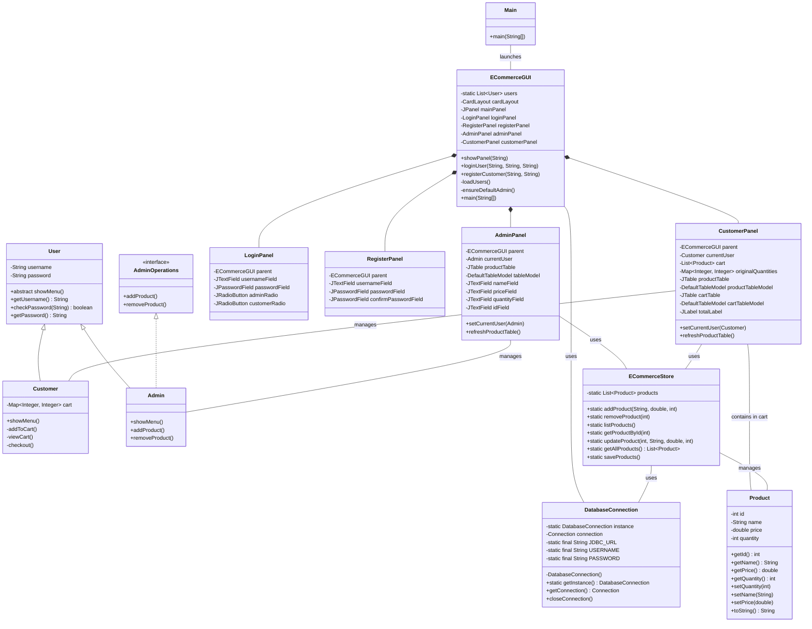
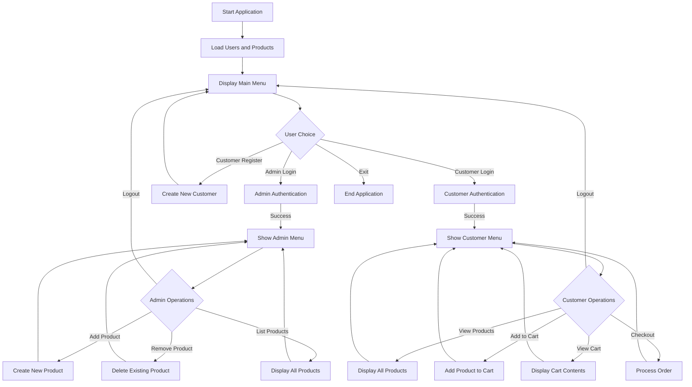

# ECOMMERCE PROJECT

This is an ecommerce application built with Java Swing, JDBC MySQL Database. 

- [x] Build a basic version with classes and methods
- [x] Make different packages for different functionalities
- [x] Integrate File handling for data storage
- [x] Start with a basic GUI focusing more on functionalities
- [x] Integrate JDBC (MySQL) for data storage
- [x] Create different tables and their schemas based on the model
- [x] Finish with the documentation

## Installation & Usage

This application uses Docker for the database and requires Java to run. The included build scripts handle all dependencies and setup automatically.

### Prerequisites

- Java Development Kit (JDK) 11 or above
- Docker Desktop (for database)

> **Note:** You don't need to install the prerequisites manually! The build scripts can automatically install Java and Docker if they're not already on your system.

### Windows

1. Clone or download this repository
2. Double-click `build.bat` or run it from Command Prompt
3. Follow the on-screen instructions
   - The script will check for Java and Docker, download the MySQL connector if needed, and start the application
   - If dependencies are missing, you'll be guided to install them or you can run `build.bat --install-dependencies`

### macOS

1. Clone or download this repository
2. Open Terminal and navigate to the project directory
3. Make the build script executable: `chmod +x build.sh`
4. Run the script: `./build.sh`
5. Follow the on-screen instructions
   - The script will check for Java and Docker, download the MySQL connector if needed, and start the application
   - If dependencies are missing, you'll be guided to install them or you can run `./build.sh --install-dependencies`

### Linux

1. Clone or download this repository
2. Open Terminal and navigate to the project directory
3. Make the build script executable: `chmod +x build.sh`
4. Run the script: `./build.sh`
5. Follow the on-screen instructions
   - The script will check for Java and Docker, download the MySQL connector if needed, and start the application
   - If dependencies are missing, you'll be guided to install them or you can run `./build.sh --install-dependencies`

### Command-line Options

Both `build.sh` and `build.bat` support the following options:

- `--clean` - Clean, build, and run the application
- `--build-only` - Only compile without running
- `--run-only` - Run without recompiling
- `--docker-reset` - Reset the Docker container and database (WARNING: this will reset all data)
- `--auto-shutdown` - Automatically stop Docker when application exits
- `--install-dependencies` - Automatically install all required dependencies (Java, Docker, etc.)
- `-i` - Short for `--install-dependencies`
- `--help` - Show help information

### Automatic Dependency Installation

If you're new to programming or don't have Java and Docker installed:

1. Simply run:
   ```
   # On Windows:
   build.bat --install-dependencies
   
   # On macOS/Linux:
   ./build.sh --install-dependencies
   ```

2. The script will:
   - Check for Java and install it if needed
   - Check for Docker and install it if needed (including Docker Desktop on macOS/Windows)
   - Download the MySQL connector
   - Guide you through any necessary steps

This means you can run the application without any prior setup - the script handles everything!

### Default Credentials

- Admin: username `admin`, password `admin123`
- Demo products are automatically loaded on first run

### Managing the Database Manually

If you need to manually manage the Docker container or directly interact with the MySQL database:

#### Starting and Stopping Docker Container

```bash
# Start the MySQL container
docker-compose up -d

# Stop the MySQL container
docker-compose down
```

For Linux users, you might need to use `sudo`:

```bash
# Start with sudo
sudo docker-compose up -d

# Stop with sudo
sudo docker-compose down
```

#### Accessing MySQL Command Line

To interact with the database directly via MySQL CLI:

```bash
# Connect to MySQL CLI
docker exec -it ecommerce_db mysql -uecomuser -pecompass

# For Linux users who need sudo
sudo docker exec -it ecommerce_db mysql -uecomuser -pecompass
```

#### Useful MySQL Commands

Once connected to the MySQL CLI, you can use these commands:

```sql
-- Show all databases
SHOW DATABASES;

-- Select the ecommerce database
USE ecommerce_db;

-- List all tables
SHOW TABLES;

-- View table structure
DESCRIBE users;
DESCRIBE products;

-- View data in tables
SELECT * FROM users;
SELECT * FROM products;

-- Exit MySQL CLI
EXIT;
```

## Class Diagram



## Application Flow


