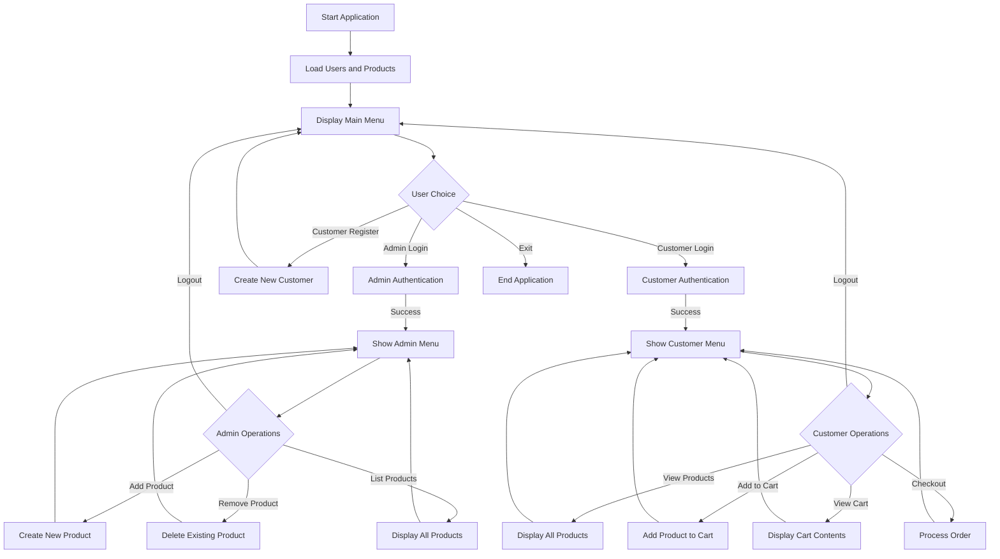

# ECOMMERCE PROJECT

This is an ecommerce application built with Java Swing, JDBC MySQL Database. 

- [x] Build a basic version with classes and methods
- [x] Make different packages for different functionalities
- [x] Integrate File handling for data storage
- [ ] Start with a basic GUI focusing more on functionalities
- [ ] Integrate JDBC (MySQL) for data storage
- [ ] Create different tables and their schemas based on the model
- [ ] Polish the UI
- [ ] Finish with the documentation

## Class Diagram

```mermaid
classDiagram
    class User {
        -String username
        -String password
        +abstract showMenu()
        +getUsername() String
        +checkPassword(String) boolean
        +getPassword() String
    }
    
    class Customer {
        -List~Product~ cart
        +showMenu()
        -addToCart()
        -viewCart()
        -checkout()
    }
    
    class Admin {
        +showMenu()
        +addProduct()
        +removeProduct()
    }
    
    class Product {
        -int id
        -String name
        -double price
        -int quantity
        +getId() int
        +getName() String
        +getPrice() double
        +getQuantity() int
        +setQuantity(int)
        +toString() String
    }
    
    class Main {
        -static List~User~ users
        -static final String ADMIN_FILE
        -static final String CUSTOMER_FILE
        +static main(String[])
        +static registerCustomer()
        +static login(String)
        -static loadUsers()
        -static saveUsers()
    }
    
    class ECommerceStore {
        -static final String PRODUCT_FILE
        -static List~Product~ products
        -static int productIdCounter
        +static addProduct(String, double, int)
        +static removeProduct(int)
        +static listProducts()
        +static getProductById(int)
        -static loadProducts()
        -static saveProducts()
    }
    
    interface UserOperations {
        +addProduct()
        +removeProduct()
    }
    
    User <|-- Customer
    User <|-- Admin
    UserOperations <|.. Admin
    Customer o-- "*" Product : contains
    Main -- "*" User : manages
    ECommerceStore -- "*" Product : manages
```

## Application Flow


